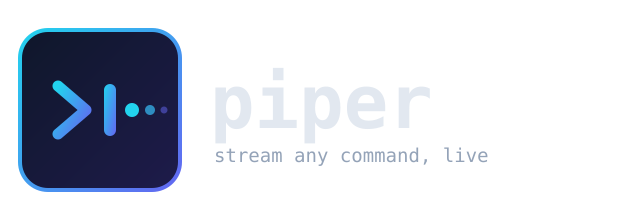
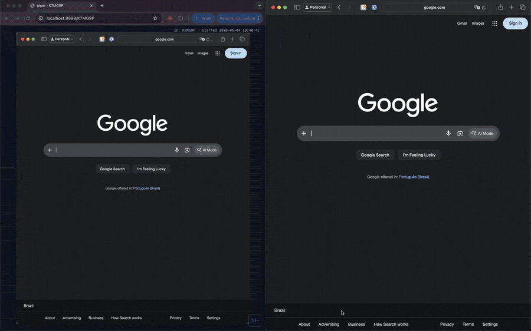
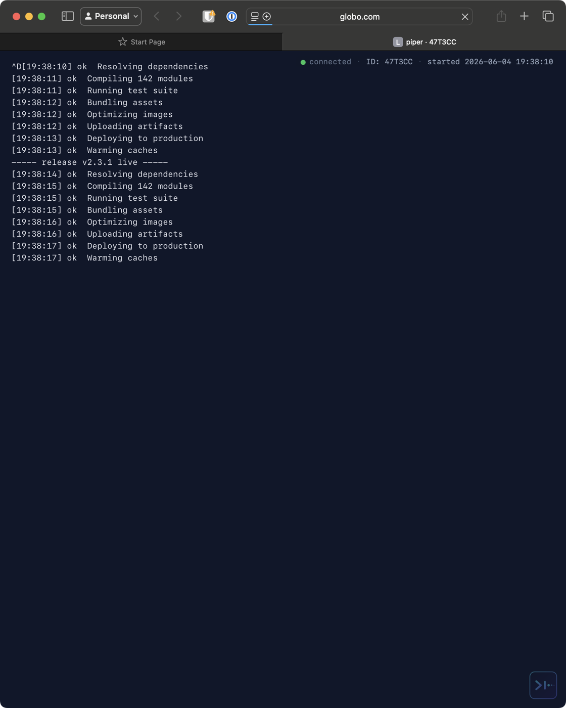

<p align="center">
  
</p>

<p align="center">
  <strong>Stream any command's output live over HTTP.</strong><br>
  Watch a long build, a deploy, or a test run from a browser or <code>curl</code> — on your LAN, or the public internet via Tailscale, Cloudflare, or ngrok.
</p>

<p align="center">
  <a href="#install"></a>
  
  
  
</p>

---

<p align="center">
  
</p>

## What it does

You run a command. Piper runs it for you, prints the output to your terminal exactly as normal — **and** serves that same output, live, over HTTP. Anyone you share the URL with sees it stream in real time.

```bash
piper ping google.com
```

```
  Stream ready!  id QGNABD  (host)
  Local:     http://localhost:9999/QGNABD
  Tailscale: http://100.x.y.z:9999/QGNABD

  Terminal:  open http://100.x.y.z:9999/QGNABD in a browser
  Viewers:   curl -N http://100.x.y.z:9999/QGNABD
  Tip:       run with --manager to view multiple pipes at http://100.x.y.z:9999/
```

Now `curl -N http://100.x.y.z:9999/QGNABD` from another machine (or open it in a browser) and watch it stream live, line by line.

<p align="center">
  
</p>

## Features

- **Single static binary** — written in Go, zero runtime dependencies. No Node, no Python, nothing to install alongside it.
- **Run several at once** — every piper gets a unique id and shares one port. The first to start hosts the server; the rest attach to it automatically (no daemon, no port juggling). `piper --list` shows what's running.
- **Browser view** — open the URL in a browser for a dark, auto-scrolling log page (a tiny dependency-free HTML page embedded in the binary). `curl` still gets the raw stream.
- **Stream live output** — every line of stdout/stderr is broadcast to all connected viewers as it happens.
- **Real TTY, no buffering** — runs your command under `script(1)` so colors and progress bars render and output isn't stuck in a pipe buffer.
- **Two modes** — run a command directly (`piper <cmd>`) or pipe into it (`somecmd | piper`).
- **Multiple viewers** — connect as many curl/browser clients as you want; slow clients are dropped instead of stalling everyone.
- **Replay buffer** — late joiners immediately get the last 100 lines, then keep streaming.
- **Pluggable public sharing** — `--public` auto-detects an installed tunnel; or force one with `--tailscale`, `--cloudflared`, or `--ngrok`.
- **LAN sharing out of the box** — auto-detects your Tailscale IP and prints a ready-to-share URL.
- **Health check** — `GET /health` returns `ok` for uptime probes.
- **Custom port** — `--port 8080` or `PORT=8080`.

## Install

### Homebrew (macOS & Linux)

```bash
brew install djalmaaraujo/tap/piper
```

### One-command script

```bash
curl -fsSL https://raw.githubusercontent.com/djalmaaraujo/piper/main/install.sh | bash
```

Downloads the right prebuilt binary for your OS/arch into `/usr/local/bin` (or `~/.local/bin`).

### Manual

Grab a binary from the [Releases page](https://github.com/djalmaaraujo/piper/releases), extract, and put `piper` on your `PATH`. Or build from source (see [Development](#development)).

## Usage

```bash
piper <command>                 # run a command and stream its output
piper --public <command>        # also share publicly (auto-detect a tunnel)
piper --tailscale <command>     # force Tailscale Funnel
piper --cloudflared <command>   # force a Cloudflare quick tunnel (no account)
piper --ngrok <command>         # force ngrok
piper --port 8080 <command>     # share on a custom port
piper --manager <command>       # enable the web index (/) of running streams
piper --list                    # list pipers running on this machine
piper screen "<window name>"    # share a macOS window as a live image
<command> | piper               # pipe mode (reads stdin)
```

### Running several at once

Just run `piper` again — it won't clash. Each instance gets a unique id and is served on the same port:

```
http://localhost:9999/USHS82          # browser (terminal-style log page)
curl -N http://localhost:9999/USHS82  # raw stream
```

The index of everything running (`http://localhost:9999/`) is **disabled by default** so a viewer can't enumerate your streams — you need the id to reach one. Start any piper with `--manager` to enable the index page.

The first piper to start owns the HTTP server (the "host"); later ones attach to it and push their output over a local unix socket. If the host exits, another instance takes over automatically. The default port is `9999`, but if something else is already using it piper quietly tries the next free port (and other pipers find it there). Running pipers are tracked in `~/piper-config.json`; hitting an id that isn't running returns a friendly *broken pipe* page.

### Screen sharing (macOS)

Share a single window to the same web page, as a live image:

```bash
piper screen                       # native picker — choose a window from a list
piper screen "Chrome"              # share the first window matching "Chrome"
piper screen --list-windows        # print shareable windows
piper screen --fps 10 "Slack"      # target rate (capped to what capture allows)
piper screen --scale 1600 "Cursor" # cap frame width (px); 0 = native
piper screen --quality 40 "Chrome" # JPEG quality 1-100 (lower = smaller/faster)
```

Run with no name and piper pops a **native window picker** (a macOS list dialog) to choose from. It captures the chosen window with `screencapture`, streams it as MJPEG to `/<id>` (image centered on the page), and viewers watch in a browser.

**Permission.** Screen sharing needs macOS **Screen Recording** access (to read window titles and capture). piper asks for it **only the first time you run `piper screen`** — never when streaming commands. If you miss the prompt, enable your terminal under *System Settings → Privacy & Security → Screen Recording* and run it again.

**Resource use / limits.**
- Each frame is one `screencapture` (+ a single `sips` pass for resize + quality). That capture spawns a process, so the real ceiling is ~5–8 fps; piper measures it and reports the actual rate (`asked 30, capture allows ~5`) instead of pretending.
- Bandwidth ≈ **fps × frame size**. Lower `--quality` (default 60) and `--scale` (default 1100) shrink frames a lot — drop them for remote viewers over a tunnel.
- It's a frame stream, not smooth video — great for "watch what's happening", not 60 fps motion.
- **Disk stays bounded**: frames use one temp file, overwritten each tick and deleted right after it's read (and on exit) — nothing accumulates.
- Sharing the window you're *watching* in just produces a harmless infinity-mirror effect; resource use is fixed at the capture rate, no feedback loop.
- **Smoother over a tunnel:** add `?buffer=<ms>` to the page URL (e.g. `…/<id>?buffer=600`) for a client-side jitter buffer — it holds ~that many ms of frames and plays them at a steady cadence (with catch-up), evening out uneven arrival. It trades a little latency for smoothness; it can't raise the frame rate. Default `0` plays live.

### Public sharing

`--public` picks the first tunnel it finds installed, in this order: **Tailscale → Cloudflare → ngrok**. Pin a specific one with its flag.

| Provider | Flag | Setup |
|----------|------|-------|
| Tailscale Funnel | `--tailscale` | [Tailscale](https://tailscale.com) installed + logged in, Funnel enabled for your tailnet |
| Cloudflare | `--cloudflared` | [`cloudflared`](https://developers.cloudflare.com/cloudflare-one/connections/connect-networks/downloads/) installed — **quick tunnels need no account** |
| ngrok | `--ngrok` | [`ngrok`](https://ngrok.com) installed + `ngrok config add-authtoken <token>` once |

> **Heads-up:** `--public` exposes your command's output to the internet. Don't stream logs that contain secrets.

### Examples

```bash
# Watch a build from your phone on the same Tailnet
piper npm run build

# Share a deploy log with a teammate, no account needed
piper --cloudflared ./deploy.sh

# Stream an existing log file
tail -f /var/log/app.log | piper

# Pick a port
piper --port 8080 pytest -v
```

### Viewing a stream

Each stream has its own id (shown in the banner). Use it in the URL:

```bash
curl -N http://localhost:9999/QGNABD   # -N disables curl buffering
```

…or just open the URL in a browser for the log page.

## How it works

```
              ┌─────────── piper ───────────┐
  your cmd ──►│ script(1) PTY ─► broadcast() │──► your terminal (stdout)
              │                      │        │
              │                      ├────────┼──► HTTP client (curl)
              │                      ├────────┼──► HTTP client (browser)
              │                      └──► ring buffer (last 100 lines)
              └──────────────────────────────┘
                         │
              tunnel provider (with --public):
              Tailscale Funnel · Cloudflare · ngrok
```

Piper launches your command inside a pseudo-terminal via `script(1)` so programs behave as if attached to a real terminal (colors, unbuffered output). Each chunk of output is written to your own stdout, fanned out to every connected HTTP client, and appended to a 100-line ring buffer so new viewers get recent context immediately.

## Platform support

| | Command mode (`piper <cmd>`) | Pipe mode (`cmd \| piper`) | Viewing |
|--|--|--|--|
| **macOS** | ✅ | ✅ | ✅ |
| **Linux** | ✅ | ✅ | ✅ |
| **Windows** | ❌ (needs `script(1)` — use [WSL](https://learn.microsoft.com/windows/wsl/)) | ✅ | ✅ |

Command mode relies on the `script(1)` utility (built in on macOS and Linux). On Windows, pipe a command's output into piper, or run it under WSL.

## Development

Pure Go, standard library only — no third-party modules.

```bash
git clone https://github.com/djalmaaraujo/piper.git
cd piper
go build -o piper .
./piper echo "hello from piper"
```

Open another terminal and `curl -N http://localhost:9999` to see the stream.

```bash
go vet ./...        # static checks
go test ./...       # unit tests
go build ./...      # compile
```

### Project layout

| File | Purpose |
|------|---------|
| `main.go` | flags, the fan-out hub + replay buffer, command/pipe sources |
| `broker.go` | host/guest roles, port selection, HTTP routing, index, banner |
| `ids.go` | unique stream id generation |
| `state.go` | `~/piper-config.json` + `piper --list` |
| `tunnels.go` | `Tunnel` interface + Tailscale / Cloudflare / ngrok providers |
| `web/index.html` | the embedded browser log page (no third-party JS) |
| `util.go` | TTY detection |
| `.goreleaser.yaml` | release archives, checksums, Homebrew cask |

### Adding a tunnel provider

Implement the `Tunnel` interface in `tunnels.go` (`Name`, `Available`, `Start`, `Stop`) and add it to the list in `startTunnel`. Each provider just shells out to its CLI and reports the public URL.

### Contributing

1. Fork and branch: `git checkout -b my-change`.
2. Keep it dependency-free (standard library only).
3. Test both modes:
   ```bash
   go run . bash -c 'for i in 1 2 3; do echo line $i; sleep 1; done'
   # in another shell:
   curl -N http://localhost:9999
   ```
4. Run `go vet ./...` and confirm cross-compilation: `GOOS=linux go build -o /dev/null .`
5. Open a pull request describing what changed and why.

### Releasing

Releases are cut by [GoReleaser](https://goreleaser.com) on a tag:

```bash
git tag v0.2.0
git push origin v0.2.0
```

CI builds binaries for macOS/Linux/Windows (amd64 + arm64), publishes a GitHub Release, and updates the Homebrew cask in [`djalmaaraujo/homebrew-tap`](https://github.com/djalmaaraujo/homebrew-tap). The tap update needs a `HOMEBREW_TAP_GITHUB_TOKEN` repo secret (a PAT with `repo` scope on the tap).

## License

[MIT](LICENSE) © Djalma Araújo
